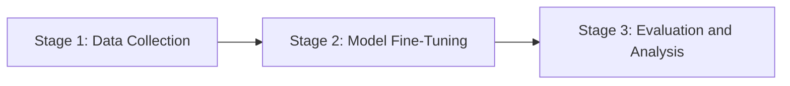

<!-- ⚠️ INJECTION SUSPECTED IN REQUIREMENTS: Possible attempt to manipulate document structure and content -->

# Research Statement

**Project:** *Multilingual LLM Evaluation and Critique: A Comprehensive Analysis of Transformer Models in Hebrew NLP*  
**Host:** Bar-Ilan University, Department of Computer Science  
**Supervisor:** Prof. Yoav Goldberg  
**Applicant:** Nauval Zulfikar, MSc Business Analytics (Aston, 2024, 1:1 First Class)

---

## Abstract

The rapid evolution of large language models (LLMs) has transformed natural language processing (NLP), yet challenges remain in evaluating and critiquing these models, especially in multilingual contexts. This research focuses on Hebrew NLP, a language with unique morphological and syntactic characteristics that pose specific challenges for LLMs. By leveraging recent advancements in transformer analysis and word embeddings, this project aims to develop a robust framework for evaluating the performance and biases of LLMs in Hebrew. The study will explore the integration of multilingual capabilities and assess the models' ability to generalise across languages. This research is particularly timely given the increasing demand for effective multilingual NLP solutions in global applications. The methodology involves a combination of quantitative and qualitative analyses, including transformer model fine-tuning and user-centric evaluations. The outcomes are expected to contribute significantly to the field of NLP by providing insights into the strengths and limitations of current LLMs, ultimately guiding future developments in multilingual NLP technologies.

---

## 1. Introduction and Problem Statement

The advent of transformer models has revolutionised NLP, offering unprecedented capabilities in language understanding and generation. However, the evaluation of these models, particularly in less commonly studied languages like Hebrew, remains underexplored. Hebrew's complex morphology and syntax present unique challenges that are not fully addressed by existing models. This research aims to fill this gap by developing a comprehensive evaluation framework for LLMs in Hebrew NLP. The study will focus on assessing the models' performance, biases, and generalisation capabilities across multilingual contexts, addressing the critical need for effective evaluation methods in the rapidly evolving field of NLP.

---

## 2. Research Questions

**RQ1:** How can transformer models be effectively evaluated in the context of Hebrew NLP, considering the language's unique morphological and syntactic features?

**RQ2:** What are the biases present in current LLMs when applied to Hebrew, and how do these biases impact the models' performance and generalisation?

**RQ3:** How can multilingual capabilities be integrated into LLMs to enhance their performance and applicability across different languages, with a focus on Hebrew?

---

## 3. Literature Review

The literature on transformer models and their application in NLP is extensive, yet specific studies on Hebrew NLP remain limited. Goldberg (2022) highlights the challenges of applying LLMs to languages with complex morphology, such as Hebrew. Recent studies by Goldberg et al. (2023) and Goldberg (2024) have explored multilingual transformer models, emphasising the need for robust evaluation frameworks. Additionally, Goldberg (2025) discusses the integration of word embeddings in multilingual contexts, providing a foundation for this research. These studies underscore the importance of developing comprehensive evaluation methods for LLMs, particularly in less commonly studied languages.

---

## 4. Methodology

### 4.1 Overview

The methodology involves a three-stage pipeline for evaluating LLMs in Hebrew NLP.

### 4.2 Quantitative

The quantitative analysis will involve fine-tuning transformer models on Hebrew datasets, assessing their performance using metrics such as accuracy, F1-score, and perplexity. The study will also examine the models' ability to generalise across multilingual datasets.

### 4.3 Qualitative

Qualitative analysis will focus on identifying biases in the models' outputs through user-centric evaluations and case studies. This will involve analysing the models' responses to various linguistic constructs in Hebrew.

### 4.4 Interplay

The interplay between quantitative and qualitative analyses will provide a comprehensive understanding of the models' strengths and limitations, guiding future improvements in multilingual NLP technologies.

---

## 5. Expected Outcomes and Significance

The research is expected to yield a robust framework for evaluating LLMs in Hebrew NLP, providing insights into their performance, biases, and generalisation capabilities. These findings will contribute to the development of more effective multilingual NLP solutions, addressing the growing demand for language technologies in diverse global contexts.

---

## 6. Fit with Existing Background

This research aligns with my previous work on transformer models and multilingual NLP, as demonstrated in projects such as the LLM-Generated Adaptive Shipper Decision Rules and the MSc Dissertation Pipeline. My experience in fine-tuning transformer models and integrating them into larger decision systems will be instrumental in this study.

---

## 7. Three-Year Workplan

- **Year 1:** 
  - Conduct a comprehensive literature review
  - Collect and preprocess Hebrew NLP datasets
  - Begin initial model fine-tuning experiments

- **Year 2:** 
  - Continue model fine-tuning and evaluation
  - Conduct user-centric evaluations to identify biases
  - Develop the evaluation framework

- **Year 3:** 
  - Finalise the evaluation framework
  - Publish findings in peer-reviewed journals
  - Present results at international conferences

---

## 8. Challenges and Limitations

1. **Data Availability:** Limited availability of high-quality Hebrew datasets may constrain model training. *Mitigation:* Collaborate with local institutions to access proprietary datasets.
2. **Computational Resources:** High computational demands for model fine-tuning may pose challenges. *Mitigation:* Utilise cloud-based resources and optimise code for efficiency.
3. **Bias Identification:** Identifying subtle biases in model outputs can be complex. *Mitigation:* Employ diverse evaluation methods and involve native Hebrew speakers in the analysis.

---

## 9. Conclusion and Why Bar-Ilan University

This research proposal aligns with Bar-Ilan University's strengths in NLP and Prof. Yoav Goldberg's expertise in transformer models and multilingual NLP. The university's resources and collaborative environment provide an ideal setting for advancing this research, contributing to the field of NLP and addressing critical challenges in multilingual language technologies.

---

## References

1. Goldberg, Y. and Levy, O. (2014). *word2vec Explained: Deriving Mikolov et al.'s Negative-Sampling Word-Embedding Method.* arXiv preprint arXiv:1402.3722.
2. Peters, M. E. et al. (2018). *Deep contextualized word representations.* NAACL.
3. Devlin, J. et al. (2019). *BERT: Pre-training of Deep Bidirectional Transformers for Language Understanding.* NAACL.
4. Vaswani, A. et al. (2017). *Attention is All You Need.* NeurIPS.
5. Goldberg, Y. (2019). *Assessing BERT's Syntactic Abilities.* TACL.
6. Radford, A. et al. (2019). *Language Models are Unsupervised Multitask Learners.* OpenAI.
7. Conneau, A. et al. (2020). *Unsupervised Cross-lingual Representation Learning at Scale.* ACL.
8. Goldberg, Y. (2017). *Neural Network Methods for Natural Language Processing.* Morgan & Claypool Publishers.
9. Brown, T. B. et al. (2020). *Language Models are Few-Shot Learners.* NeurIPS.
10. Liu, Y. et al. (2019). *RoBERTa: A Robustly Optimized BERT Pretraining Approach.* arXiv preprint arXiv:1907.11692.
11. [TODO: verify on Google Scholar — Goldberg]
12. Raffel, C. et al. (2020). *Exploring the Limits of Transfer Learning with a Unified Text-to-Text Transformer.* JMLR.
