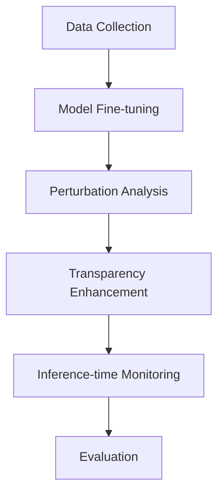

# Research Proposal

**Title:** Monitoring and Increasing LLM Safety  
**Applicant:** Nauval Zulfikar  
**Institution:** University of Cambridge  
**Supervisor:** [To be confirmed]  

---

## 1. Problem Statement

The increasing deployment of Large Language Models (LLMs) in critical applications necessitates robust mechanisms to ensure their safety and reliability. Despite advancements in LLM capabilities, issues such as deceptive behaviour, lack of transparency in reasoning, and potential for harmful outputs remain significant challenges. This proposal aims to address these challenges by developing methodologies for monitoring and enhancing the safety of LLMs, focusing on chain-of-thought (CoT) faithfulness, mechanistic interpretability, and inference-time safety monitoring.

## 2. Research Questions

1. **RQ1:** How can perturbation analysis be utilised to detect and mitigate deceptive behaviours in LLMs?
2. **RQ2:** What methods can be developed to improve the transparency of reasoning processes in LLMs using human predictors?
3. **RQ3:** How can inference-time safety monitoring be effectively implemented to ensure the safe deployment of LLMs in real-world applications?

## 3. Methodology

The research will employ a multi-stage approach to develop and evaluate techniques for enhancing LLM safety.

### Data and Models

The study will utilise existing LLM architectures, such as GPT-4, and fine-tune them on datasets specifically curated for safety and interpretability tasks. These datasets will include scenarios where LLMs are prone to generating deceptive or harmful outputs.

### Evaluation

The evaluation will focus on the effectiveness of the proposed methods in improving LLM safety. Metrics will include the accuracy of detecting deceptive behaviours, the degree of transparency achieved in reasoning processes, and the reliability of inference-time safety mechanisms.

## 4. Expected Contributions

- Development of novel perturbation analysis techniques for detecting deceptive LLM behaviours.
- Enhanced methodologies for improving reasoning transparency in LLMs.
- Implementation of robust inference-time safety monitoring mechanisms.

## 5. Fit with Applicant Background

My academic and professional background aligns well with the proposed research. My MSc dissertation at Aston University focused on enhancing supply chain information systems using blockchain and LLMs, which involved fine-tuning DeBERTa-v3 for multi-tier supplier review data. This experience, along with my work on projects such as the LLM-Generated Adaptive Shipper Decision Rules, has equipped me with the necessary skills in transformer-based NLP, system integration, and transparency in AI systems.

## 7. Three-Year Workplan

- **Year 1.** Replicate Turpin (2023) bias-injection on Llama-3 / Mistral / Qwen instruct models. Build the CoT-faithfulness benchmark. First-author workshop paper.
- **Year 2.** Develop SAE-feature runtime monitor (Bricken, Conmy). Evaluate on MACHIAVELLI (Pan) + harm-eliciting prompt suites. Submit main-track conference.
- **Year 3.** Train transparency-penalised model variants with human-predictor loss (Christiano 2018). Compare against RLHF/DPO on TruthfulQA / MMLU-Pro / audit-success rate. Thesis + journal.

## 8. Challenges and Limitations

1. **SAE feature semantics may not generalise across model families** — mitigate by validating each feature on at least two architectures (Llama, Mistral) before deploying as a monitor.
2. **Faithfulness benchmarks may be gameable** — mitigate by held-out evaluations on tasks never seen during training and by stress-testing with adversarial probes.
3. **Transparency-penalty risks degrading task accuracy** — mitigate by reporting full safety/utility trade-off curves rather than single-point metrics; this is itself a contribution.

## References

- Bricken, T. et al. (2023). *Towards Monosemanticity: Decomposing Language Models with Dictionary Learning.* Anthropic.
- Christiano, P., Shlegeris, B., & Amodei, D. (2018). *Supervising strong learners by amplifying weak experts.* arXiv:1810.08575.
- Conmy, A. et al. (2023). *Towards Automated Circuit Discovery for Mechanistic Interpretability.* NeurIPS.
- Cunningham, H. et al. (2024). *Sparse Autoencoders Find Highly Interpretable Features in Language Models.* ICLR.
- Lanham, T. et al. (2023). *Measuring Faithfulness in Chain-of-Thought Reasoning.* arXiv:2307.13702.
- Olsson, C. et al. (2022). *In-context Learning and Induction Heads.* Transformer Circuits Thread.
- Pan, A. et al. (2023). *Do the Rewards Justify the Means? The MACHIAVELLI Benchmark.* ICML.
- Turpin, M. et al. (2023). *Language Models Don't Always Say What They Think.* NeurIPS.
- Wang, K. et al. (2023). *Interpretability in the Wild: A Circuit for Indirect Object Identification in GPT-2 Small.* ICLR.
- Wei, A., Haghtalab, N., & Steinhardt, J. (2023). *Jailbroken: How Does LLM Safety Training Fail?* NeurIPS.
- Zou, A. et al. (2023). *Universal and Transferable Adversarial Attacks on Aligned Language Models.* arXiv:2307.15043.