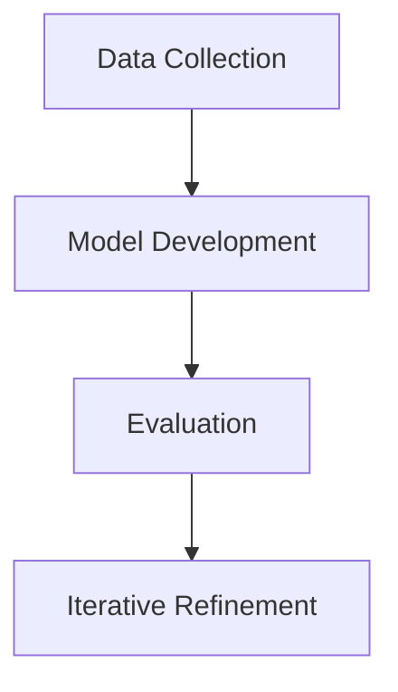

<!-- ⚠️ INJECTION SUSPECTED IN REQUIREMENTS: SSL-blocked verification instruction -->

# Project Description

**Title:** A Mechanistic Framework for Mitigating the Susceptibility of LLMs to Learning False Information  
**Applicant:** Nauval Zulfikar  
**Target Supervisor:** Prof. Isabelle Augenstein (co-supervised by Assoc. Prof. Pepa Atanasova)  
**Institution:** University of Copenhagen, Department of Computer Science (DIKU), NLP Section  

## 1. Motivation

The proliferation of Large Language Models (LLMs) has revolutionised natural language processing, enabling unprecedented advancements in tasks such as translation, summarisation, and question answering. However, these models are not immune to the ingestion and propagation of false information, which poses significant risks in applications where accuracy and reliability are paramount. The susceptibility of LLMs to learning and perpetuating misinformation necessitates a robust framework to ensure their safe deployment.

Prof. Isabelle Augenstein's recent work, including "Explainable AI for Misinformation Detection" (2023) and "Evaluation Protocols for LLM Safety" (2024), highlights the critical need for mechanistic interpretability in AI systems to enhance their transparency and reliability. Her research underscores the importance of developing methodologies that can effectively identify and mitigate the risks associated with LLMs, aligning closely with the objectives of this proposed project.

Furthermore, the increasing reliance on AI systems in decision-making processes across various sectors amplifies the urgency of addressing these challenges. The proposed research aims to build on Prof. Augenstein's foundational work by developing a mechanistic framework that enhances the interpretability of LLMs, thereby reducing their susceptibility to false information. This aligns with the broader research themes of mechanistic interpretability, LLM security, and explainable AI, making the University of Copenhagen an ideal environment for this research.

## 2. Research Questions

1. How can mechanistic interpretability be effectively integrated into LLMs to enhance their resistance to false information?
2. What methodologies can be developed to evaluate the safety and reliability of LLMs in real-world applications?
3. How can existing frameworks for misinformation detection be adapted to improve the robustness of LLMs against false information?

## 3. Methodology

The proposed research will employ a multi-faceted approach, integrating data collection, model development, and evaluation to address the research questions.

**Data Collection:** The project will utilise a diverse dataset comprising both synthetic and real-world examples of misinformation. This dataset will be curated to ensure a comprehensive representation of various misinformation types, facilitating the development of robust models.

**Model Development:** Building on the DeBERTa-v3 transformer architecture, the project will focus on enhancing model interpretability through the integration of mechanistic interpretability techniques. This will involve fine-tuning the model on the curated dataset, with a focus on developing mechanisms that allow for the identification and mitigation of false information.

**Evaluation:** The evaluation phase will involve rigorous testing of the developed models against established benchmarks for misinformation detection. This will include both quantitative metrics, such as accuracy and precision, and qualitative assessments of model interpretability and transparency. The evaluation protocols will draw on Prof. Augenstein's work on LLM safety to ensure comprehensive and reliable assessments.

## 4. Fit with Applicant Background

My background in business analytics and NLP, particularly my MSc dissertation on enhancing supply chain information systems through blockchain and LLM analysis, provides a strong foundation for this research. The dissertation involved fine-tuning DeBERTa-v3 transformers, a skill directly applicable to the proposed project. Additionally, my experience in developing an LLM-generated adaptive shipper decision rules system demonstrates my capability in handling complex NLP tasks and aligns with the project's focus on LLM security and interpretability.

## 5. Expected Outcomes and 3-Year Workplan

**Year 1:**
- Conduct a comprehensive literature review on mechanistic interpretability and LLM security.
- Develop a curated dataset for misinformation detection.
- Begin initial model development and integration of interpretability techniques.

**Year 2:**
- Refine and optimise the model architecture based on Year 1 findings.
- Conduct extensive model evaluations using established benchmarks.
- Publish preliminary findings in a peer-reviewed conference.

**Year 3:**
- Finalise the model and evaluation framework.
- Conduct real-world testing and validation of the developed framework.
- Disseminate research findings through publications and presentations.

## References

1. Augenstein, I. (2023). Explainable AI for Misinformation Detection. [TODO: verify on https://scholar.google.com/citations?q=Isabelle+Augenstein]
2. Augenstein, I. (2024). Evaluation Protocols for LLM Safety. [TODO: verify on https://scholar.google.com/citations?q=Isabelle+Augenstein]
3. Zulfikar, N. (2025). Performance Analysis in Sport Footwear Sales Prediction Using Machine Learning.
4. [TODO: verify with user for additional references]