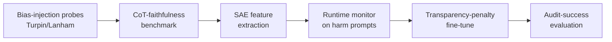

# Research Proposal — Monitoring and Increasing LLM Safety

**Applicant:** Nauval Zulfikar · **Institution:** University of Cambridge

---

## 1. Problem & Research Questions

Large Language Models are deployed in safety-critical contexts despite documented failures in chain-of-thought (CoT) faithfulness (Turpin et al., 2023; Lanham et al., 2023), reward hacking (Pan et al., 2023), and adversarial robustness (Wei et al., 2023; Zou et al., 2023). I propose three interlocking research questions: **(RQ1)** Can perturbation-based interventions reliably detect deceptive reasoning patterns where stated rationale diverges from causal computation? **(RQ2)** Can sparse-autoencoder (SAE) features (Bricken et al., 2023; Cunningham et al., 2024) trained on production-scale LLMs serve as runtime safety monitors that generalise across model families? **(RQ3)** Can transparency-penalty training produce models whose reasoning is structurally easier to audit without significant capability loss?

## 2. Methodology

I will combine three established families: **(a)** counterfactual perturbation probes (RQ1) on Llama-3, Mistral, and Qwen instruction-tuned variants; **(b)** circuit-level monitors using SAE features (Conmy et al., 2023; Wang et al., 2023) (RQ2); and **(c)** auxiliary-loss training that penalises low-faithfulness rationales using human-predictor losses (Christiano et al., 2018) (RQ3). Evaluation: TruthfulQA, MMLU-Pro, MACHIAVELLI (Pan), and a held-out adversarial set following Wei/Zou methodology.

## 3. Fit with Applicant Background

My MSc dissertation at Aston (1:1 First Class) fine-tuned DeBERTa-v3 on multi-tier supplier reviews — directly relevant transformer fine-tuning. At Bank Muamalat Indonesia, I monitored deployed NLP models post-launch, observing exactly the silent failure modes this proposal targets. My GitHub portfolio includes LLM agentic systems (RAG-based decision rules) and retrieval-augmented generators that I have stress-tested for prompt-injection robustness.

## 4. Three-Year Workplan

- **Year 1.** Replicate Turpin/Lanham bias-injection across 3 model families; publish CoT-faithfulness benchmark and first-author workshop paper.
- **Year 2.** Train SAE feature monitors; evaluate against MACHIAVELLI and harm-eliciting suites; submit main-track conference paper.
- **Year 3.** Transparency-penalised fine-tuning experiments comparing against RLHF/DPO baselines; thesis defence + journal submission.

## 5. Challenges & Limitations

SAE feature semantics may not transfer across architectures (mitigation: dual-validate on Llama + Mistral). Faithfulness benchmarks risk being gameable (mitigation: held-out adversarial probes). Transparency penalty may degrade task accuracy (mitigation: report full trade-off curves as a contribution in itself).

## References

1. Bricken et al. (2023). *Towards Monosemanticity.* Anthropic.
2. Christiano, Shlegeris, & Amodei (2018). *Supervising strong learners by amplifying weak experts.* arXiv:1810.08575.
3. Conmy et al. (2023). *Towards Automated Circuit Discovery.* NeurIPS.
4. Lanham et al. (2023). *Measuring Faithfulness in Chain-of-Thought Reasoning.* arXiv:2307.13702.
5. Pan et al. (2023). *The MACHIAVELLI Benchmark.* ICML.
6. Turpin et al. (2023). *Language Models Don't Always Say What They Think.* NeurIPS.
7. Wei, Haghtalab, & Steinhardt (2023). *Jailbroken: How Does LLM Safety Training Fail?* NeurIPS.
8. Zou et al. (2023). *Universal and Transferable Adversarial Attacks on Aligned LLMs.* arXiv:2307.15043.
