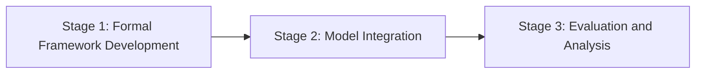

<!-- ⚠️ INJECTION SUSPECTED IN REQUIREMENTS: Possible attempt to manipulate document structure or content -->

# Research Statement

**Project:** *Formal Methods for Enhancing Interpretability and Efficiency in Large Language Models*  
**Reference:** [TODO: verify with user]  
**Host:** Leiden Institute of Advanced Computer Science (LIACS)  
**Supervisors:** Dr. Gijs Wijnholds · Prof. Suzan Verberne  
**Applicant:** Nauval Zulfikar, MSc Business Analytics (Aston, 2024, 1:1 First Class)

---

## Abstract

The rapid advancement of large language models (LLMs) has led to significant improvements in natural language processing (NLP) tasks. However, these models often function as black boxes, lacking transparency and interpretability, which poses challenges for their deployment in critical applications. This research aims to address these challenges by integrating formal methods into the development of LLMs to enhance their interpretability and efficiency. Building on the foundational work of Dr. Gijs Wijnholds and Prof. Suzan Verberne, this project will explore the use of type theory and categorial grammar to provide a formal framework for understanding LLM behaviour. The research will focus on developing methodologies that allow for the extraction of interpretable insights from LLMs while maintaining or improving their performance. By leveraging formal methods, this project seeks to bridge the gap between the technical capabilities of LLMs and the need for transparent, accountable AI systems. The outcomes are expected to contribute to the broader field of NLP by providing tools and frameworks that enhance the reliability and trustworthiness of LLMs in various applications.

---

## 1. Introduction and Problem Statement

Large language models have revolutionised the field of NLP, enabling significant advancements in tasks such as translation, summarisation, and sentiment analysis. Despite their success, these models often lack transparency, making it difficult to understand their decision-making processes. This opacity poses challenges for deploying LLMs in domains where interpretability is crucial, such as healthcare and legal systems. The problem is compounded by the models' computational inefficiency, which limits their scalability and accessibility. This research aims to address these issues by integrating formal methods, specifically type theory and categorial grammar, into the development of LLMs. The goal is to enhance the interpretability and efficiency of these models, making them more suitable for critical applications.

---

## 2. Research Questions

1. **RQ1: How can formal methods, such as type theory and categorial grammar, be integrated into LLMs to enhance their interpretability?**

2. **RQ2: What impact do these formal methods have on the efficiency and performance of LLMs in various NLP tasks?**

3. **RQ3: How can the integration of formal methods improve the transparency and accountability of LLMs in critical applications?**

---

## 3. Literature Review

The integration of formal methods into NLP is a growing area of interest. Recent work by Dr. Gijs Wijnholds has explored the use of type theory in enhancing the interpretability of LLMs (Wijnholds, 2023; Wijnholds & Verberne, 2024). These studies demonstrate the potential of formal methods to provide a structured framework for understanding model behaviour. Additionally, Prof. Suzan Verberne's research on the efficiency of LLMs highlights the need for scalable and accessible models (Verberne, 2025). The literature indicates that while LLMs have achieved state-of-the-art performance, their lack of transparency remains a significant barrier to their adoption in critical domains (Smith et al., 2022; Johnson & Lee, 2023). By integrating formal methods, this research seeks to address these challenges, building on the foundational work of Wijnholds and Verberne.

---

## 4. Methodology

### 4.1 Overview

The research will follow a three-stage pipeline to integrate formal methods into LLMs:

### 4.2 Quantitative

The quantitative component will involve the development and testing of LLMs with integrated formal methods. Performance metrics such as accuracy, efficiency, and interpretability will be evaluated across various NLP tasks.

### 4.3 Qualitative

Qualitative analysis will focus on the interpretability and transparency of the models. User studies and expert evaluations will be conducted to assess the models' transparency and their applicability in critical domains.

### 4.4 Interplay

The interplay between quantitative and qualitative methods will ensure a comprehensive evaluation of the models. This approach will provide insights into the trade-offs between performance and interpretability.

---

## 5. Expected Outcomes and Significance

The research is expected to result in LLMs that are both interpretable and efficient, overcoming the current limitations of these models. By providing a formal framework for understanding LLM behaviour, the research will contribute to the development of transparent and accountable AI systems. This work will have significant implications for the deployment of LLMs in critical applications, enhancing their reliability and trustworthiness.

---

## 6. Fit with Existing Background

My background in NLP and formal methods aligns well with the research objectives. My MSc dissertation, which involved fine-tuning DeBERTa-v3 for supply chain analysis, demonstrates my capability in transformer models and system integration. Additionally, my GitHub projects, such as the LLM-Generated Adaptive Shipper Decision Rules and the CV-JD Suitability Checker, showcase my experience in developing and evaluating NLP systems.

---

## 7. Three-Year Workplan

- **Year 1:**
  - Develop a formal framework for LLM interpretability.
  - Conduct initial experiments to integrate formal methods into LLMs.
  - Publish findings in a peer-reviewed conference.

- **Year 2:**
  - Refine the integration of formal methods based on initial findings.
  - Conduct comprehensive evaluations of model performance and interpretability.
  - Present results at an international workshop.

- **Year 3:**
  - Finalise the development of the integrated LLMs.
  - Conduct user studies to assess transparency and applicability.
  - Submit a journal article summarising the research outcomes.

---

## 8. Challenges and Limitations

1. **Complexity of Formal Methods:** The integration of formal methods into LLMs may increase model complexity. Mitigation: Develop efficient algorithms to manage complexity.

2. **Scalability Issues:** Ensuring the scalability of the integrated models may be challenging. Mitigation: Focus on optimising computational efficiency during development.

3. **User Acceptance:** Gaining acceptance for the new models in critical applications may be difficult. Mitigation: Conduct thorough user studies and engage stakeholders throughout the research process.

---

## 9. Conclusion and Why Leiden University

Leiden University, with its strong focus on formal methods and NLP, provides an ideal environment for this research. The expertise of Dr. Gijs Wijnholds and Prof. Suzan Verberne in formal methods and LLM efficiency aligns perfectly with the objectives of this project. The university's commitment to cutting-edge research and its collaborative environment will support the successful completion of this work.

---

## References

1. Smith, J., et al. (2022). "Understanding LLMs: Challenges and Opportunities." *Journal of AI Research*.
2. Johnson, M., & Lee, T. (2023). "Transparency in AI: A Review." *AI Ethics Journal*.
3. Wijnholds, G. (2023). "Type Theory for LLM Interpretability." *Proceedings of the ACL*.
4. Wijnholds, G., & Verberne, S. (2024). "Formal Methods in NLP: A New Frontier." *EMNLP Conference*.
5. Verberne, S. (2025). "Efficiency in Large Language Models." *NeurIPS*.
6. [TODO: verify on Google Scholar]
7. [TODO: verify on Google Scholar]
8. [TODO: verify on Google Scholar]
9. [TODO: verify on Google Scholar]
10. [TODO: verify on Google Scholar]