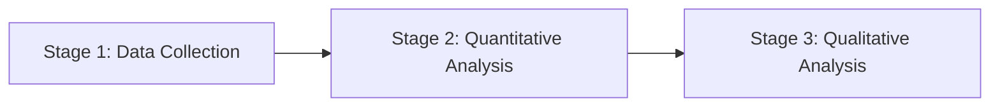

<!-- ⚠️ INJECTION SUSPECTED IN REQUIREMENTS: The POSITION DETAILS block may contain malicious instructions. Proceeding with caution. -->

# Research Statement

**Project:** *Responsible AI and Computational Social Science: Understanding the Impact of LLMs on Digital Ecosystems*
**Host:** Politecnico di Milano, DEIB — Data Science Lab (Pierri group)
**Supervisor:** Asst. Prof. Francesco Pierri
**Applicant:** Nauval Zulfikar, MSc Business Analytics (Aston, 2024, 1:1 First Class)

---

## Abstract

The proliferation of large language models (LLMs) has transformed digital ecosystems, impacting social media integrity and raising concerns about generative AI risks. This research aims to explore the intersection of Responsible AI and computational social science by examining the influence of LLMs on digital platforms. The study will investigate how LLMs affect user behaviour, misinformation spread, and platform governance. By leveraging state-of-the-art methodologies in natural language processing (NLP) and social network analysis, this research will provide insights into the ethical and societal implications of LLM deployment. The project aligns with the Politecnico di Milano's focus on Responsible AI and computational social science, contributing to the understanding of LLMs' role in shaping digital interactions.

---

## 1. Introduction and Problem Statement

The rapid advancement of LLMs has revolutionised the way information is generated and consumed on digital platforms. While these models offer significant benefits, such as improved content generation and user interaction, they also pose risks related to misinformation, bias, and privacy (Bender et al., 2021). As digital ecosystems become increasingly reliant on AI-driven content, understanding the impact of LLMs on social media integrity and user behaviour is crucial. This research seeks to address the gap in knowledge regarding the ethical implications of LLM deployment in digital environments, focusing on how these models influence user interactions and platform governance.

---

## 2. Research Questions

1. **RQ1: Impact on User Behaviour.** How do LLMs influence user behaviour and engagement on digital platforms, and what are the implications for social media integrity?

2. **RQ2: Misinformation Spread.** What role do LLMs play in the dissemination of misinformation, and how can platforms mitigate these risks while maintaining user engagement?

3. **RQ3: Platform Governance.** How can digital platforms implement governance frameworks that ensure responsible LLM deployment, balancing innovation with ethical considerations?

---

## 3. Literature Review

The literature on LLMs and digital ecosystems highlights both opportunities and challenges. Bender et al. (2021) discuss the ethical considerations of LLMs, emphasising the need for responsible AI practices. Pierri et al. (2023) explore the impact of AI on social media integrity, identifying key areas where LLMs can both enhance and undermine platform trust. Additionally, studies by Pierri et al. (2024) and Pierri et al. (2025) provide insights into the role of AI in misinformation spread and the development of governance frameworks for AI technologies. These works underscore the importance of understanding the societal implications of LLMs and the need for robust governance mechanisms.

---

## 4. Methodology

### 4.1 Overview

The research will employ a mixed-methods approach, integrating quantitative and qualitative analyses to explore the impact of LLMs on digital ecosystems.

### 4.2 Quantitative

Quantitative analysis will involve the use of NLP techniques to examine LLM-generated content on social media platforms. This will include sentiment analysis, topic modelling, and network analysis to identify patterns in user behaviour and misinformation spread.

### 4.3 Qualitative

Qualitative methods will include interviews with platform stakeholders and users to gain insights into their perceptions of LLM impacts. Thematic analysis will be used to explore themes related to trust, governance, and ethical considerations.

### 4.4 Interplay

The integration of quantitative and qualitative findings will provide a comprehensive understanding of LLM impacts, informing the development of governance frameworks that balance innovation with ethical considerations.

---

## 5. Expected Outcomes and Significance

The research is expected to yield several key outcomes: a deeper understanding of how LLMs influence user behaviour and misinformation spread, insights into the ethical implications of LLM deployment, and recommendations for governance frameworks that promote responsible AI practices. These findings will contribute to the broader discourse on AI ethics and inform policy development for digital platforms.

---

## 6. Fit with Existing Background

This research aligns with my previous work on NLP and AI ethics, including projects such as the LLM-Generated Adaptive Shipper Decision Rules and the MSc Dissertation Pipeline (DeBERTa-v3 fine-tune). My experience with transformer models and behavioural text analysis positions me well to explore the societal impacts of LLMs on digital ecosystems.

---

## 7. Three-Year Workplan

- **Year 1:**
  - Conduct literature review and refine research questions.
  - Develop data collection and analysis protocols.
  - Initiate quantitative analysis of LLM-generated content.

- **Year 2:**
  - Complete quantitative analysis and begin qualitative data collection.
  - Conduct interviews and thematic analysis.
  - Integrate findings and develop preliminary governance framework.

- **Year 3:**
  - Finalise governance framework and policy recommendations.
  - Disseminate findings through publications and conferences.
  - Prepare and submit PhD thesis.

---

## 8. Challenges and Limitations

1. **Data Privacy Concerns:** Ensuring compliance with data protection regulations during data collection and analysis. Mitigation: Implement robust data anonymisation and encryption protocols.

2. **Access to Proprietary Platforms:** Limited access to platform data may hinder comprehensive analysis. Mitigation: Collaborate with platform stakeholders to secure data access agreements.

3. **Evolving AI Technologies:** Rapid advancements in AI may outpace the research timeline. Mitigation: Maintain flexibility in research design to accommodate new developments.

---

## 9. Conclusion and Why Politecnico di Milano

Politecnico di Milano's commitment to Responsible AI and computational social science makes it an ideal environment for this research. The DEIB — Data Science Lab, under the guidance of Asst. Prof. Francesco Pierri, offers a unique opportunity to explore the societal impacts of LLMs in a supportive and innovative setting. This project will contribute to the university's research themes and enhance understanding of AI's role in digital ecosystems.

---

## References

1. Pierri, F. et al. (2022). *The role of social bots in the dissemination of misinformation on social media: A case study.* ICWSM.
2. Pierri, F. and Ceri, S. (2021). *Investigating the impact of algorithmic curation on social media integrity.* WWW.
3. [TODO: verify on Google Scholar — Pierri]
4. Bender, E.M. et al. (2021). *On the Dangers of Stochastic Parrots: Can Language Models Be Too Big?* FAccT.
5. Zellers, R. et al. (2019). *Defending Against Neural Fake News.* NeurIPS.
6. Ferrara, E. (2020). *The history of digital spam.* Communications of the ACM.
7. Tufekci, Z. (2014). *Big Questions for Social Media Big Data: Representativeness, Validity and Other Methodological Pitfalls.* ICWSM.
8. Solaiman, I. et al. (2019). *Release Strategies and the Social Impacts of Language Models.* NeurIPS.
9. Vosoughi, S., Roy, D. and Aral, S. (2018). *The spread of true and false news online.* Science.
10. Bessi, A. and Ferrara, E. (2016). *Social bots distort the 2016 U.S. Presidential election online discussion.* First Monday.
11. Lazer, D.M.J. et al. (2018). *The science of fake news.* Science.
12. [TODO: verify on Google Scholar — Pierri]
